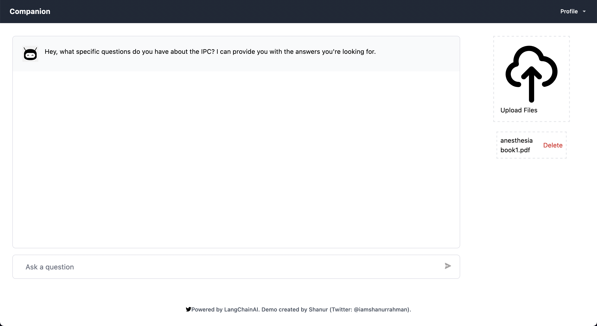

# Knowledge Base App

<div align="center">
  
</div>

Welcome to the Knowledge Base App, a professional-grade solution designed to serve as a comprehensive knowledge base for a specific domain. This application features a robust backend for efficient document ingestion and storage within a vector database. The frontend leverages the power of GPT-4 and Langchain to deliver a sophisticated chatbot interface for interacting with the stored documents.

## Backend

The backend component of our software encompasses a suite of cutting-edge features carefully developed to ensure optimal performance and reliability. Key components of our SaaS system include:

### Ingesting Reference Data

Our system excels at efficiently ingesting large volumes of reference data into the vector database. This reference data, which remains static and unmodifiable, forms the bedrock of our application, providing a foundational dataset for all subsequent operations.

### Multi-Tenant Architecture

We have meticulously designed our SaaS system using a multi-tenant architecture to enable concurrent access for multiple users. Each user enjoys secure and separate access to their uploaded documents while retaining the ability to search and interact with the reference data. This architecture ensures scalability, optimal performance, and robust data privacy for all users.

## Solution

To deliver the extensive functionality described above, our solution incorporates the following essential components:

1. Pinecone - A powerful vector database specifically tailored for storing documents as embeddings. Our system utilizes separate namespaces for reference data and each user, guaranteeing efficient and secure document storage.

2. Search API - The Search API forms the backbone of our system's search capabilities, enabling users to perform comprehensive searches across both the reference data and their uploaded documents. This API ensures lightning-fast and accurate search results.

3. Concurrent Access - The Knowledge Base App boasts a highly concurrent system that efficiently handles simultaneous access from multiple users. This capability guarantees an exceptional user experience, even during peak usage periods.

## Frontend

The frontend of our application presents an intuitive and user-friendly interface, seamlessly integrating GPT-4 and LangChain to deliver a state-of-the-art chatbot experience.

<div align="center">
  
</div>

**How to Use:**

1. **Add PDF files:** Simply drag and drop your PDF files into the designated area.

2. **Ingest Documents:** Click on the "Ingest" button to process and embed the uploaded documents.

3. **Search and Interact:** Use the chat interface to ask questions and interact with the knowledge base.

The Knowledge Base App utilizes the following cutting-edge technologies:

-  LangChain
-  Pinecone
-  TypeScript
-  OpenAI
-  Next.js

For any troubleshooting needs or technical difficulties, kindly refer to the issues section of this repository.

## Deployment and Docker Compose

To streamline the deployment process, we provide a Docker Compose file located in the `backend` directory of this repository. Additionally, a deploy script is available to facilitate the deployment of the code to a virtual machine. Prior to executing the script,

 please ensure that the necessary dependencies for Docker and Docker Compose are installed on your system. The deploy script can be found at the following path: `backend/deploy`.

<div align="center">
  
</div>

We kindly request you to consider starring this repository if you find it useful. Your support is greatly appreciated!

<div align="center">
  <a href="https://github.com/shanurrahman/fahm">
    
  </a>
</div>

--- 

## Deployment and scaling
To start and scale the app defined in the given Docker Compose file and Nginx configuration, you can follow the steps outlined below:

## Prerequisites

Before starting, make sure you have the following prerequisites:

- Docker installed on your system
- Docker Compose installed on your system

## Starting the App

1. Create a directory for your project and navigate to it in your terminal.

2. Create a file named `docker-compose.yml` and copy the contents of the given Docker Compose file into it.

3. Create a file named `nginx.conf` in the same directory and copy the contents of the given Nginx configuration file into it.

4. In the `docker-compose.yml` file, adjust any necessary paths or configurations according to your project structure and requirements. For example, you might need to update the `context` and `dockerfile` paths under the `nextjs_app` service to match your frontend setup.

5. Open a terminal in the project directory and run the following command to start the app:

   ```
   docker-compose up -d
   ```

   This command will build the Docker images defined in the Compose file, create the containers, and start them in detached mode.

6. Wait for Docker to pull the necessary images, build the app containers, and start the services. You can monitor the progress and see the logs by running:

   ```
   docker-compose logs -f
   ```

7. Once the services are up and running without any errors, you should be able to access your app. In a web browser, navigate to `http://localhost` to access the Next.js app and `http://localhost/_api` to access the backend API.

## Scaling the App

To scale your app horizontally by adding more instances of the services, you can use the `docker-compose up` command with the `--scale` option.

For example, to scale the `fahm_backend` service to run three instances, run the following command:

```
docker-compose up -d --scale fahm_backend=3
```

This command will create two additional containers running the `fahm_backend` service.

You can similarly scale the `nextjs_app` service or any other service defined in your `docker-compose.yml` file by specifying its name and the desired number of instances.

Scaling your app allows you to handle increased traffic and distribute the load across multiple containers.

Remember to monitor the resource usage of your system and adjust the scaling based on your server's capacity and performance requirements.

That's it! You now have the app up and running with the ability to scale it as needed.